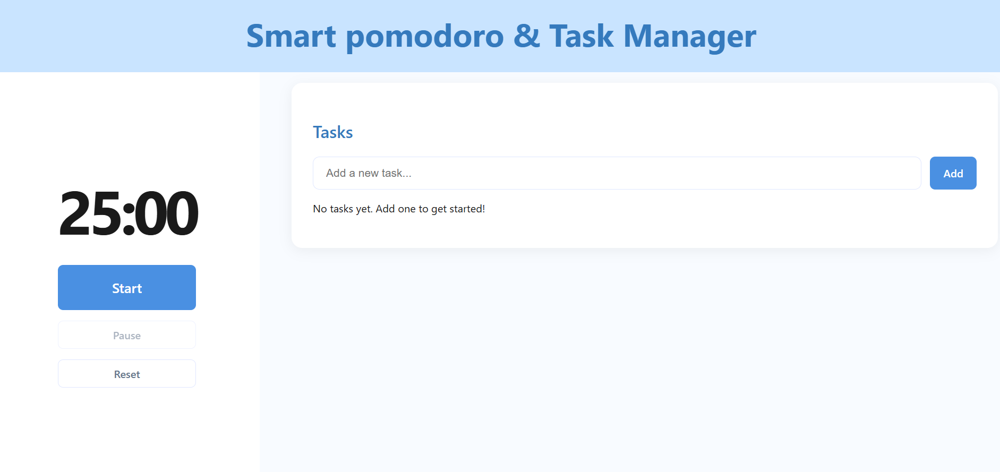
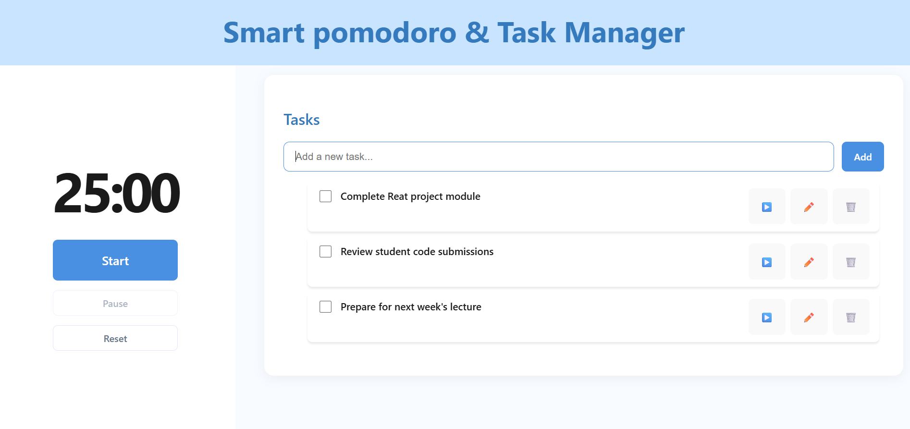
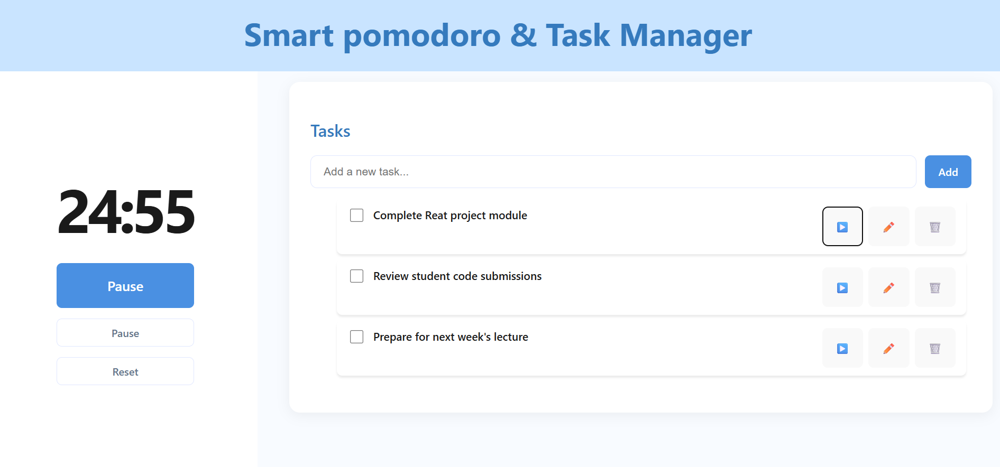
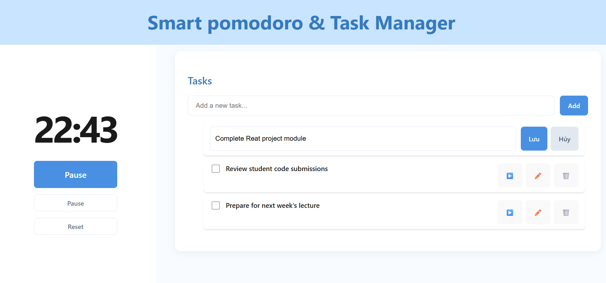

1.Giới thiệu

Smart Pomodoro & Task Manager là một ứng dụng web kết hợp giữa quản lý công việc (To‑Do List) và đồng hồ Pomodoro, giúp người dùng tập trung làm việc hiệu quả hơn thông qua kỹ thuật quản lý thời gian Pomodoro (25 phút mỗi phiên).

Dự án được xây dựng với mục tiêu thực hành React Hooks, quản lý trạng thái ứng dụng và xử lý logic thời gian thực. Đây là một project rất phù hợp cho sinh viên hoặc người mới học React muốn nâng cao tư duy tổ chức component và state.

2.Chức năng chính

- Thêm, sửa, xóa công việc
- Đánh dấu công việc đã hoàn thành
- Gắn đồng hồ Pomodoro (25 phút) cho từng công việc
- Đếm ngược thời gian và thông báo khi kết thúc phiên Pomodoro
- Tạm dừng / tiếp tục timer
- Làm nổi bật công việc đang được thực hiện

3.Mô tả ứng dụng

Người dùng có thể tạo danh sách các công việc cần làm. Mỗi công việc có thể được khởi động một phiên Pomodoro 25 phút để tập trung làm việc.

Ứng dụng sẽ:

- Đếm ngược thời gian theo từng giây
- Thay đổi trạng thái giao diện khi timer chạy
- Phát thông báo hoặc thay đổi tiêu đề trình duyệt khi hết giờ

4.Giao diện & Trạng thái hoạt động

4.1. Giao diện chính (Chưa có công việc)

- Hiển thị đồng hồ Pomodoro
- Danh sách công việc trống
- Cho phép người dùng thêm công việc mới
Component chính: Timer, TaskInput

4.2. Giao diện chính (Đã có công việc)

- Danh sách công việc được hiển thị bằng map()
- Mỗi công việc có các nút:
  * ▶️ Bắt đầu Pomodoro
  * ✏️ Chỉnh sửa
  * 🗑️ Xóa
Component chính: TaskList, TaskItem

4.3. Trạng thái Timer đang chạy

- Đồng hồ bắt đầu đếm ngược
- Công việc đang chạy được highlight
- Nút Start chuyển thành Pause

4.4. Trạng thái chỉnh sửa công việc (Inline Edit)

- Nội dung công việc chuyển sang ô input
- Cho phép chỉnh sửa trực tiếp ngay trong danh sách

5. Kiến thức & Công nghệ áp dụng

* React Hooks
- useState: Quản lý state cơ bản (input, timer, UI)
- useEffect: Xử lý side‑effects (đếm ngược, thông báo)
- useReducer`: Quản lý state phức tạp cho danh sách công việc
- useRef: Lưu trữ ID của setInterval để clear timer khi cần

Các action tiêu biểu:

* ADD_TASK
* DELETE_TASK
* EDIT_TASK
* TOGGLE_COMPLETE
* START_TASK
* STOP_TASK